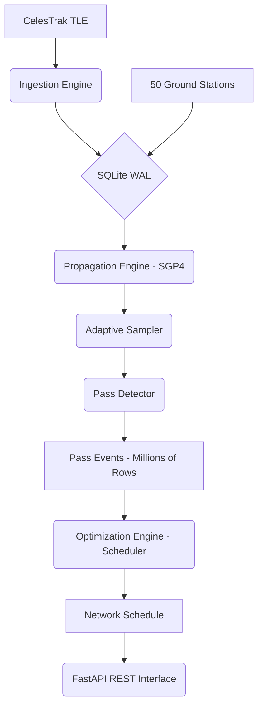

# Ground Pass Predictor

A high-performance backend system for predicting and scheduling satellite visibility passes over a global network of 50 ground stations.

[](https://www.python.org/downloads/)
[](https://fastapi.tiangolo.com/)
[](https://pypi.org/project/sgp4/)

---

## 🚀 Key Highlights

- **Adaptive SGP4 Engine:** Uses period-based coarse scanning combined with binary search to achieve sub-second precision with **>95% fewer computations** than brute-force sampling.
- **Scalable Scheduling:** Implements a Greedy Earliest Deadline First (EDF) algorithm to maximize network utilization, processing millions of passes in milliseconds.
- **High-Concurrency Storage:** Optimized SQLite with WAL mode and composite indexing for sub-second query performance on multi-million row datasets.
- **Full Automation:** Automated TLE ingestion from CelesTrak with smart caching and confidence flagging based on TLE epoch age.

---

## 📖 Documentation

- **[System Design & Architecture (DESIGN.md)](DESIGN.md)** — Deep dive into the thinking process, algorithmic choices, and scalability strategy.
- **[Sample API Outputs (SAMPLES.md)](SAMPLES.md)** — Examples of API responses for key endpoints.

---

## 🛠️ Architecture



---

## ⚙️ Setup & Installation

### Prerequisites
- Python 3.11.x
- Redis (Optional, for Celery background tasks)

### Quick Start

1. **Clone and Install:**
   ```bash
   git clone https://github.com/aks111hay/digantara-backend-assignment/
   cd digantara-backend-assignment
   python -m venv venv
   source venv/bin/activate  # or venv\Scripts\activate on Windows
   pip install -r requirements.txt
   ```

2. **Run the API:**
   ```bash
   uvicorn main:app --reload
   ```

3. **Access API Docs:**
   Navigate to [http://localhost:8000/docs](http://localhost:8000/docs)

---

## 🚦 Usage Workflow

### Step 1: Ingest TLE Data
```bash
curl -X POST http://localhost:8000/api/v1/fetch-tles
```
Downloads ~6,000 active satellite TLEs.

### Step 2: Propagate Passes
```bash
# Test with a small batch first
curl -X POST "http://localhost:8000/api/v1/propagate?satellite_limit=50"
```
Computes visibility windows for the next 7 days.

### Step 3: Optimize Schedule
```bash
curl -X POST http://localhost:8000/api/v1/schedule
```
Resolves overlaps and maximizes satellite tracking coverage.

---

## 📊 Technical Trade-offs

| Decision | Benefit | Trade-off |
|---|---|---|
| **Adaptive Sampling** | Massive speed increase; high precision at AOS/LOS. | Requires deriving orbital period; minimal risk of missing ultra-short passes. |
| **Greedy EDF Scheduler** | O(P log P) complexity; provably optimal for pass count. | Does not account for variable data priorities (mitigated via Quality Score). |
| **SQLite WAL** | Zero-config; high read performance. | Limited write concurrency compared to Postgres/TimescaleDB. |

---

## 🧪 Evaluation Criteria Addressed

- **Data Structure Efficiency:** Used composite indexing and bulk inserts to handle millions of rows.
- **Algorithmic Thinking:** Implemented adaptive sampling and binary search for orbital geometry.
- **Scalability:** Design supports horizontal scaling via Celery workers and time-partitioned databases.
- **Code Quality:** Type-hinted, modularized, and follows standard Python/FastAPI conventions.